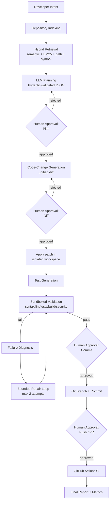

# Architecture

## Overview

Intent2Deploy AI coordinates repository intelligence (RAG), LLM planning,
code generation, AI-assisted testing, sandboxed validation, bounded
failure repair, and Git/GitHub automation behind explicit human approval
checkpoints.

## Components

| Layer | Technology | Location |
|---|---|---|
| API | FastAPI, Pydantic | `backend/app/api/` |
| Persistence | SQLModel over SQLite | `backend/app/models/` |
| Repository indexing | LangChain text splitters + custom AST/regex chunking | `backend/app/services/rag/` |
| Vector store | ChromaDB (deterministic offline hashing embedding by default) | `backend/app/services/rag/vectorstore.py` |
| Retrieval | Hybrid: semantic + BM25 + path + symbol, merged/reranked | `backend/app/services/rag/retriever.py` |
| Prompt library | Versioned Markdown+YAML prompt templates | `backend/prompts/` |
| LLM providers | Anthropic / OpenAI / Local (mock) behind one interface | `backend/app/services/providers/` |
| Planning | Structured JSON plan, evidence-validated | `backend/app/services/planner/` |
| Code generation | Structured diff proposals, safety-limited | `backend/app/services/codegen/` |
| Test generation | Framework-matching generated tests | `backend/app/services/testing/` |
| Validation | Sandboxed, allowlisted command execution | `backend/app/services/validation/` |
| Git / GitHub | GitPython + PyGithub, gated by approval | `backend/app/services/git/`, `backend/app/services/github/` |
| Orchestration | Workflow state machine + audit trail | `backend/app/services/orchestrator.py`, `state_machine.py` |
| Evaluation | Benchmark tasks + runner | `evaluation/`, `scripts/run_evaluation.py` |
| Frontend | React + Vite + TypeScript | `frontend/src/` |

## Workflow State Machine

State transitions are enforced centrally in
`backend/app/services/state_machine.py` against the explicit allowlist in
`backend/app/models/enums.py::ALLOWED_TRANSITIONS`. Any transition not in
that table is rejected with an error rather than silently applied — this
is what prevents, for example, a commit from happening before a diff has
been approved.

## Safety-critical boundaries

1. **No LLM output is trusted directly.** Every structured call goes
   through `app/core/llm_reliability.py`, which parses JSON, validates it
   against a Pydantic schema, and retries (bounded) on failure.
2. **No file path outside a repository's own directory is ever touched**
   — enforced in `app/core/security.py::validate_repository_path`.
3. **No command outside a fixed allowlist is ever executed** — enforced
   in `app/core/security.py::validate_command` and
   `app/services/validation/sandbox.py`.
4. **No workspace mutation happens before the Diff Approval checkpoint**,
   and no git push/PR happens before the External Action checkpoint —
   enforced in `app/services/orchestrator.py`.
